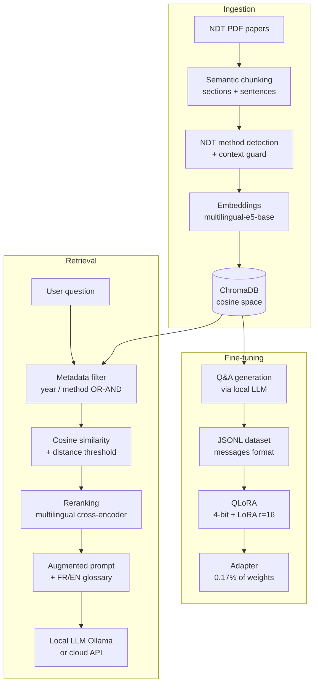

# mini-RAG NDT

*[Version française](./README_French.md)*

A RAG (Retrieval-Augmented Generation) system and QLoRA fine-tuning pipeline built **from scratch** (no LangChain, no LlamaIndex) on a corpus of Non-Destructive Testing (NDT) scientific papers — to deeply understand every layer of a production LLM pipeline, not just wire them together.

> A hands-on learning project, built iteratively with objective evaluation at every step rather than eyeballing results.

## The project in one sentence

An engineer asks a technical question in French about non-destructive testing methods (eddy current, GMR, ultrasonic testing, EMAT, MFL, ACFM...); the system retrieves the relevant passages from a corpus of scientific papers (mostly in English), reranks them by actual relevance, and generates a sourced answer — alongside a parallel pipeline that reuses this same corpus to fine-tune a local model via QLoRA.

## Architecture



## Key features

| Component | Detail |
|---|---|
| **Semantic chunking** | Section detection (numbered headings) + full-sentence splitting, objectively benchmarked against fixed-character chunking |
| **Enriched metadata** | Year + NDT method detected by keyword, with a context guard to avoid false positives (e.g., induction heating ≠ eddy-current NDT) |
| **Hybrid retrieval** | Cosine similarity + distance threshold + exact metadata filtering (both OR and AND) |
| **Reranking** | Multilingual cross-encoder (wide bi-encoder retrieval → precise cross-encoder reranking) |
| **Multilingual-robust prompting** | Built-in FR/EN glossary (scientific corpus mostly in English, questions in French) |
| **Objective evaluation** | Recall@k, Precision@k, MRR on a manually-verified ground-truth question set |
| **End-to-end QLoRA** | Synthetic dataset generated **from the RAG corpus itself**, 4-bit fine-tuning, verified generalization (not just memorization) |

## Measured results

Objective comparison, semantic vs. fixed-character chunking (8 questions, `--rerank`, `top_k=5`):

| Metric | Fixed | Semantic |
|---|---|---|
| Recall@5 | 100% | 100% |
| Precision@5 | 77.5% | **80.0%** |
| MRR | 0.917 | 0.917 |

QLoRA (Llama 3.1 8B, 34 training examples, RTX 4070 Ti):

- **0.17%** of parameters trained (13.6M / 8.04 billion) via LoRA
- `eval_loss`: 1.602 → 1.025 over 3 epochs
- Generalization verified on unseen questions (learned JSON format, not recited)

## Tech stack

| Category | Tools |
|---|---|
| Vector store | ChromaDB (cosine space) |
| Embeddings | `intfloat/multilingual-e5-base` |
| Reranking | `cross-encoder/mmarco-mMiniLMv2-L12-H384-v1` |
| Local LLM | Ollama (Llama 3.1 8B) |
| Fine-tuning | `transformers`, `peft`, `bitsandbytes` (NF4), `trl` (SFTTrainer v1.x) |
| Evaluation | Custom framework (Recall@k, Precision@k, MRR) |
| Hardware | RTX 4070 Ti (12 GB VRAM) |

## Project structure

```
rag_ndt/
├── data/                          # Source PDFs (not versioned)
├── chroma_db/                     # Vector store (generated, not versioned)
├── cnd_metadata.py                # Year + NDT method detection (context guard)
├── ingest.py                      # Extraction, chunking, embeddings, indexing
├── query.py                       # Retrieval, reranking, filtering, generation
├── eval.py                        # Objective evaluation (Recall/Precision/MRR)
├── eval_set.json                  # Manually-verified ground-truth question set
├── inspect_metadata.py            # Indexed metadata diagnostic tool
├── requirements.txt
└── finetune/
    ├── generate_dataset_from_corpus.py   # QLoRA dataset generated from ChromaDB
    ├── train_qlora.py                    # QLoRA training (4-bit + LoRA)
    ├── inference.py                      # Base vs. fine-tuned comparison
    └── requirements-finetune.txt
```

## Installation

```bash
python -m venv venv
.\venv\Scripts\Activate.ps1   # or source venv/bin/activate on Linux/Mac
pip install -r requirements.txt

# GPU: install torch with CUDA support before other dependencies
pip install torch --index-url https://download.pytorch.org/whl/cu121
```

## Usage

```bash
# 1. Indexing (semantic chunking by default)
python ingest.py

# 2. Querying, with reranking and NDT method filtering
python query.py --rerank --methods eddy_current,gmr --year-min 2018

# 3. Objective retrieval evaluation
python eval.py --rerank

# 4. QLoRA fine-tuning (separate virtual environment recommended, see finetune/)
cd finetune
python generate_dataset_from_corpus.py
python train_qlora.py
python inference.py
```

## Technical challenges encountered

A few engineering decisions that took multiple iterations, documented for transparency:

- **Chunk-level vs. document-level tagging**: tagging an NDT method at the whole-document level over-tagged survey articles (a chapter reviewing 7 methods picked up all 7 tags, even for chunks mentioning only one). Fixed by detecting the NDT context at document level, but each specific method at chunk level.
- **False positives on physics keywords**: an article on induction heating mentions eddy currents as a physical principle, without being an NDT article. Fixed with a guard requiring co-occurrence of a generic non-destructive-testing marker.
- **Chroma distance space**: L2 by default rather than cosine, making distance thresholds hard to interpret — fixed by forcing `hnsw:space: cosine` at collection creation.
- **QLoRA version compatibility on Windows**: a `bitsandbytes`/`transformers` conflict (a known bug involving a `frozenset`), resolved by migrating to the `trl` v1.x API (`SFTConfig`, `completion_only_loss`) instead of pinning old, mutually incompatible versions together.

## Known limitations

- NDT method detection is a keyword-based classifier, not a semantic model — inherently approximate
- The evaluation set (8 questions) is deliberately small: enough to catch gross regressions and compare two configurations, not to certify absolute performance
- QLoRA dataset generation quality depends on the local LLM used to generate questions/answers
- Currently a local pipeline (CLI scripts) — no API/deployment layer yet

## Next steps

FastAPI + Docker wrapping to expose the pipeline as a service, cloud LLM API integration alongside Ollama, and an expanded evaluation set.

---

🇫🇷 [Version française](README.fr.md)

## 🐳 Docker Deployment

The RAG API (FastAPI) can be served in a container, with **Ollama running on the host machine** (direct GPU access, no NVIDIA Container Toolkit setup required).

### Prerequisites

- Docker Desktop (Windows/Mac) or Docker Engine + Compose v2 (Linux)
- [Ollama](https://ollama.com) installed and running on the host, with a model available:
  ```bash
  ollama pull llama3.1:8b
  ```
- The ChromaDB index already built (outside Docker, in the local venv):
  ```bash
  python ingest.py
  ```

### Run

```bash
docker compose up --build
```

Wait for the `Application startup complete.` log line, then open
**http://localhost:8000/docs** (Swagger UI) to test the `/query` endpoint.

Quick container → Ollama connectivity check:

```bash
docker compose exec api python -c "import httpx; print(httpx.get('http://host.docker.internal:11434/api/tags').text)"
```

### Architecture decisions

| Decision | Rationale |
|---|---|
| `chroma_db/` index mounted as a **volume** (not baked into the image) | Re-ingesting the corpus does not require an image rebuild |
| Ollama on the **host**, reached via `host.docker.internal` | Native GPU access, no need to containerize the LLM |
| `extra_hosts: host.docker.internal:host-gateway` | Makes the compose file portable to Linux (no-op on Docker Desktop) |
| `python:3.11-slim` base image, ingestion/eval scripts excluded via `.dockerignore` | Minimal *serving* image: only `api.py`/`query.py` and their dependencies |
| Models loaded at **startup** (not on first request) | Cost paid once at boot; stable latency afterwards |

### Pitfalls encountered (and fixed)

| Issue | Cause | Fix |
|---|---|---|
| `chromadb.errors.InternalError: attempt to write a readonly database` at startup | ChromaDB volume mounted with `:ro`. Even for purely read-only application usage, SQLite must write its WAL files (`-wal`, `-shm`) and acquire locks on open | Mount the volume read-write (remove `:ro`) |
| API unreachable from the host despite the `8000:8000` port mapping | uvicorn was listening on `127.0.0.1`, only reachable from inside the container | `--host 0.0.0.0` in the Dockerfile `CMD` |
| Ollama unreachable from the container | Inside a container, `localhost` refers to the container itself, not the host | `host.docker.internal` in `OLLAMA_URL` + `extra_hosts` for Linux |

> **Note**: the first `/query` call may be slow if Ollama has unloaded the
> model from VRAM (automatic unload after ~5 min of inactivity) — this is
> not a Docker issue; the model is reloaded and subsequent calls return to
> normal latency.


---

*Built as a hands-on learning project on RAG and QLoRA fine-tuning. Full case study: [English](./CASE_STUDY_English.md) | [French](./CASE_STUDY_French.md)*

