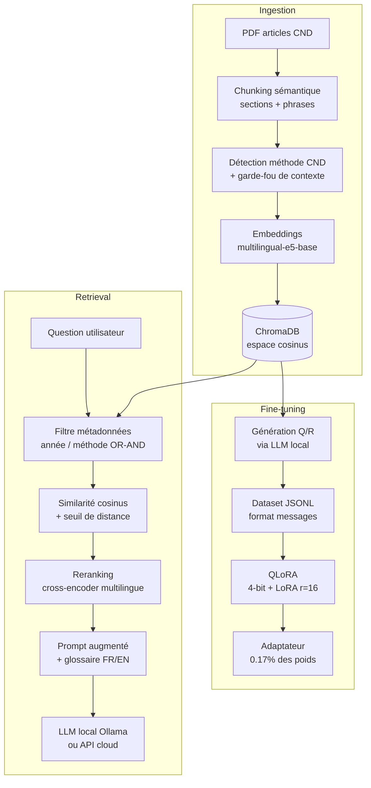

# mini-RAG CND

*[English version](./README_English.md)*

Système RAG (Retrieval-Augmented Generation) et pipeline de fine-tuning QLoRA construits **à la main** (sans LangChain/LlamaIndex) sur un corpus d'articles scientifiques de Contrôle Non Destructif (CND), pour comprendre en profondeur chaque brique d'un pipeline LLM en production — pas seulement les assembler.

> Projet d'apprentissage pratique, développé de manière itérative avec évaluation objective à chaque étape plutôt qu'un jugement à l'œil.

## Le projet en une phrase

Un ingénieur pose une question technique en français sur des méthodes de contrôle non destructif (courants de Foucault, GMR, ultrasons, EMAT, MFL, ACFM...) ; le système retrouve les passages pertinents dans un corpus d'articles scientifiques (souvent en anglais), les reclasse par pertinence réelle, et génère une réponse sourcée — avec un pipeline parallèle qui réutilise ce même corpus pour fine-tuner un modèle local via QLoRA.

## Architecture



## Fonctionnalités clés

| Composant | Détail |
|---|---|
| **Chunking sémantique** | Détection de sections (titres numérotés) + découpage par phrases entières, comparé objectivement au chunking par caractères fixes |
| **Métadonnées enrichies** | Année + méthode CND détectées par mot-clé, avec garde-fou de contexte pour éviter les faux positifs (ex : chauffage par induction ≠ CND par courants de Foucault) |
| **Retrieval hybride** | Similarité cosinus + seuil de distance + filtre exact par métadonnées (OR et AND) |
| **Reranking** | Cross-encoder multilingue (bi-encoder large → cross-encoder précis) |
| **Prompt robuste au multilinguisme** | Glossaire FR/EN intégré au prompt (corpus scientifique majoritairement anglais, questions en français) |
| **Évaluation objective** | Recall@k, Precision@k, MRR sur un jeu de questions à vérité terrain vérifiée manuellement |
| **QLoRA end-to-end** | Génération de dataset synthétique **depuis le corpus RAG lui-même**, fine-tuning 4-bit, preuve de généralisation (pas juste mémorisation) |

## Résultats mesurés

Comparaison objective chunking sémantique vs chunking à caractères fixes (8 questions, `--rerank`, `top_k=5`) :

| Métrique | Fixed | Semantic |
|---|---|---|
| Recall@5 | 100% | 100% |
| Precision@5 | 77.5% | **80.0%** |
| MRR | 0.917 | 0.917 |

QLoRA (Llama 3.1 8B, 34 exemples d'entraînement, RTX 4070 Ti) :

- **0.17%** des paramètres entraînés (13.6M / 8.04 milliards) via LoRA
- `eval_loss` : 1.602 → 1.025 sur 3 epochs
- Généralisation vérifiée sur questions inédites (format JSON appris, pas récité)

## Stack technique

| Catégorie | Outils |
|---|---|
| Vector store | ChromaDB (espace cosinus) |
| Embeddings | `intfloat/multilingual-e5-base` |
| Reranking | `cross-encoder/mmarco-mMiniLMv2-L12-H384-v1` |
| LLM local | Ollama (Llama 3.1 8B) |
| Fine-tuning | `transformers`, `peft`, `bitsandbytes` (NF4), `trl` (SFTTrainer v1.x) |
| Évaluation | Framework maison (Recall@k, Precision@k, MRR) |
| Matériel | RTX 4070 Ti (12 Go VRAM) |

## Structure du projet

```
rag_ndt/
├── data/                          # PDF sources (non versionnés)
├── chroma_db/                     # Base vectorielle (générée, non versionnée)
├── cnd_metadata.py                # Détection année + méthode CND (garde-fou de contexte)
├── ingest.py                      # Extraction, chunking, embeddings, indexation
├── query.py                       # Retrieval, reranking, filtrage, génération
├── eval.py                        # Évaluation objective (Recall/Precision/MRR)
├── eval_set.json                  # Jeu de questions à vérité terrain vérifiée
├── inspect_metadata.py            # Diagnostic des métadonnées indexées
├── requirements.txt
└── finetune/
    ├── generate_dataset_from_corpus.py   # Dataset QLoRA généré depuis ChromaDB
    ├── train_qlora.py                    # Entraînement QLoRA (4-bit + LoRA)
    ├── inference.py                      # Comparaison base vs fine-tuné
    └── requirements-finetune.txt
```

## Installation

```bash
python -m venv venv
.\venv\Scripts\Activate.ps1   # ou source venv/bin/activate sous Linux/Mac
pip install -r requirements.txt

# GPU : installer torch avec support CUDA avant les autres dépendances
pip install torch --index-url https://download.pytorch.org/whl/cu121
```

## Usage

```bash
# 1. Indexation (chunking sémantique par défaut)
python ingest.py

# 2. Interrogation, avec reranking et filtre par méthode CND
python query.py --rerank --methods eddy_current,gmr --year-min 2018

# 3. Évaluation objective du retrieval
python eval.py --rerank

# 4. Fine-tuning QLoRA (environnement virtuel séparé recommandé, voir finetune/)
cd finetune
python generate_dataset_from_corpus.py
python train_qlora.py
python inference.py
```

## Défis techniques rencontrés

Quelques décisions d'ingénierie qui ont demandé plusieurs itérations, documentées pour la transparence :

- **Chunk-level vs document-level tagging** : taguer une méthode CND au niveau du document entier sur-étiquetait les articles de synthèse (un chapitre passant en revue 7 méthodes récupérait les 7 tags même pour des chunks n'en mentionnant qu'une). Résolu en détectant le contexte CND au niveau document, mais chaque méthode spécifique au niveau chunk.
- **Faux positifs sur les mots-clés physiques** : un article sur le chauffage par induction mentionne les courants de Foucault comme principe physique, sans être un article de CND. Résolu par un garde-fou exigeant la co-occurrence d'un marqueur générique de contrôle non destructif.
- **Espace de distance Chroma** : L2 par défaut plutôt que cosinus, rendant les seuils de distance peu interprétables — corrigé en forçant `hnsw:space: cosine` à la création de la collection.
- **Compatibilité de versions QLoRA sous Windows** : conflit `bitsandbytes`/`transformers` (bug connu sur un `frozenset`), résolu en migrant vers l'API `trl` v1.x (`SFTConfig`, `completion_only_loss`) plutôt que de figer d'anciennes versions incompatibles entre elles.

## Limites assumées

- La détection de méthode CND est un classifieur par mots-clés, pas un modèle sémantique — approximatif par nature
- Le jeu d'évaluation (8 questions) est volontairement petit : suffisant pour repérer des régressions grossières et comparer deux configurations, pas pour certifier une performance absolue
- La génération du dataset QLoRA dépend de la qualité du LLM local utilisé pour générer les questions/réponses
- Pipeline actuellement local (scripts CLI) — pas encore de couche API/déploiement

## Prochaines étapes

- Wrapping FastAPI + Docker pour exposer le pipeline comme service
- Intégration d'une API LLM cloud en complément d'Ollama
- Extension du jeu d'évaluation

---

*Projet développé dans le cadre d'un apprentissage pratique du RAG et du fine-tuning QLoRA. Case study complet : [Français](./CASE_STUDY_French.md) | [English](./CASE_STUDY_English.md)*
